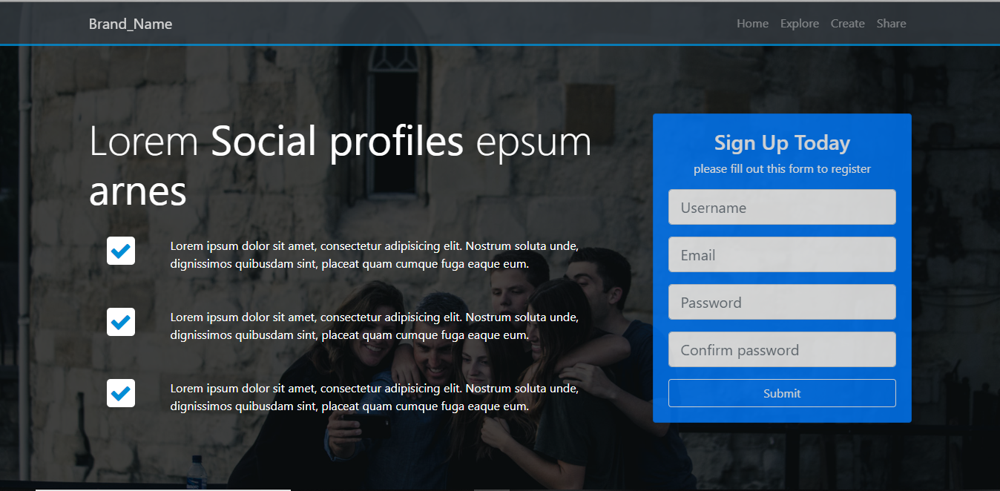

# Social Profile Template
A social profile template that is made with bootstrap and scss. It is just a frontent template that can be further connected with Backend. It is a pretty decent theme contains parallax, signUp form, modals. 

Here is the Screenshot.

As web design itself matures, designers have a better understanding of the science and the art of delivering all sorts of content to users in an effective manner. Now, the emphasis is on the polished feel. Enter HTML5 and CSS3, the powerful combination that moves the modern internet at dashing speed to hitherto unforeseen degrees of artful elegance and visual sophistication. And then, meet Parallax technologies, the immersive, engaging effects that can add depth and substance to any site or page with the most understated minimalism.
